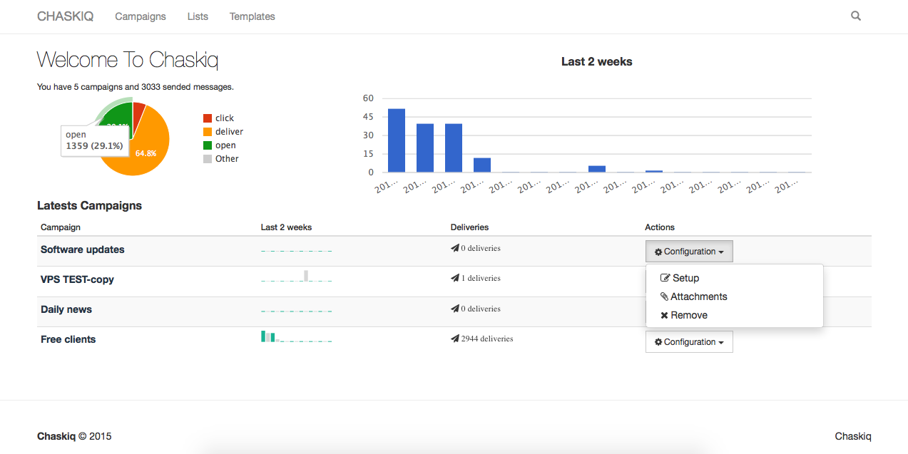

# Chaskiq

### A Rails engine to send newsletters.




<p>The <i><b>Chasquis</b></i> (also <i><b>Chaskiq (Quechua word)</b></i>) were agile and highly trained runners that delivered messages royal delicacies such as fish and other objects throughout the Inca Empire, principally in the service of the Sapa Inca.</p>

### Motivation.

I really don't like the idea to pay ~50USD/mo to send a simple newsletter, I find that commercial alternatives are really awesome, but those solutions have nothing that OS community can't achieve.

### How it works.

Chaskiq works with Amazon SES to send mails and Amazon SNS service to get the bounces & complaints. The SNS integration is optional but recommended in order to get those features.

#### Features:

+ Email template editor out of the box.
+ Mustache tags enables to use variables in templates.
+ Reusable templates.
+ Reusable email lists.
+ Tracks opens and clics.
+ Tracks Bounces and Complaints (via AWS SNS).
+ Displays reports on:
  + % of deliveries.
  + clicks , opens , bounces, complaints.
  + Detail list off who opens, clicks, bounces & complaints.

### How to install:

Use chaskiq as a gem in a rails project.

+ gem 'chaskiq' in your gemfile and execute bundle install
+ rails generate chaskiq:install (will add an initializer , route & migrations)
+ rake db:migrate

+ config/initializers/active_job.rb
  ```ActiveJob::Base.queue_adapter = :sidekiq```

### Secure system:

You can use any user system just configue Chaskiq authentication method for controllers.

Assuming you are using device, to protect the admin paths you will use the device's auth method for controllers as is.

config/initializers/chaskiq.rb

```ruby
Chaskiq::Config.setup do |config|
  config.authentication_method = :authenticate_user!
end
```

read more about heroku and vps installs, Amazon integration and more in our wiki page https://github.com/michelson/chaskiq/wiki

# TODO:
- [ ] api support.
- [ ] more insighfull reportery.
- [ ] scheduled deliveries via (sidetiq or whenever).
- [ ] send to many lists in one campaign and send to list segments (like mailchimp).

Miguel Michelson Martinez. released under MIT.
